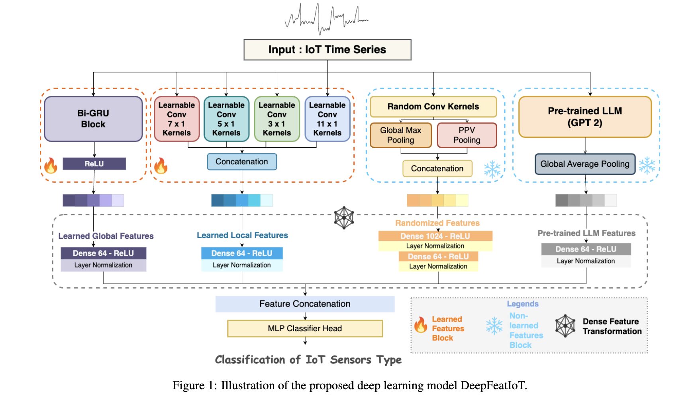
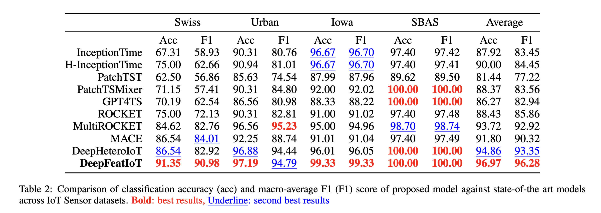

# 📄 DeepFeatIoT: Unifying Deep Learned, Randomized, and LLM Features for Enhanced IoT Time Series Sensor Data Classification in Smart Industries

Official Implementation of *"DeepFeatIoT: Unifying Deep Learned, Randomized, and LLM Features for Enhanced IoT Time Series Sensor Data Classification in Smart Industries"* accepted at **IJCAI 2025** under the special track of AI4Tech: AI Enabling Critical Technologies as a full-length oringal research article after a double blind peer-review process. This year the acceptance rate of full-length research articles were less than 18%. IJCAI is CORE A* conference and a flagship international research conference in Artificial Intelligence.

[](https://ijcai-preprints.s3.us-west-1.amazonaws.com/2025/8887.pdf)
[](https://arxiv.org/abs/2508.09468)

---

## 📌 Abstract

*Internet of Things (IoT) sensors are ubiquitous technologies deployed across smart cities, industrial sites, and healthcare systems. They continuously generate time series data that enable advanced analytics and automation in industries. However, challenges such as the loss or ambiguity of sensor metadata, heterogeneity in data sources, varying sampling frequencies, inconsistent units of measurement, and irregular timestamps make raw IoT time series data difficult to interpret, undermining the effectiveness of smart systems. To address these challenges, we propose a novel deep learning model, DeepFeatIoT, which integrates learned local and global features with non-learned randomized convolutional kernel-based features and features from large language models (LLMs). This straightforward yet unique fusion of diverse learned and non-learned features significantly enhances IoT time series sensor data classification, even in scenarios with limited labeled data. Our model's effectiveness is demonstrated through its consistent and generalized performance across multiple real-world IoT sensor datasets from diverse critical application domains, outperforming state-of-the-art benchmark models. These results highlight DeepFeatIoT's potential to drive significant advancements in IoT analytics and support the development of next-generation smart systems.*

---

## 🚀 Overview

This repository contains the official implementation of our IJCAI 2025 paper:

> **DeepFeatIoT: Unifying Deep Learned, Randomized, and LLM Features for Enhanced IoT Time Series Sensor Data Classification in Smart Industries**
> *Muhammad Sakib Khan Inan, Kewen Liao*
> Accepted at **IJCAI 2025**

We introduce **DeepFeatIoT**, which uniquely integrates: learnable local (multi-scale learnable convolutions) and global feature (bi-directional gated recurrent units) with non-learned randomized convolutional kernel features, and pretrained LLM features to enhance classification performance across various IoT sensor datasets, even in scenarios with limited labeled data.
Our approach achieves **state-of-the-art performance** on heterogenous IoT Time Series Sensor data classification task.

---

## 📂 Repository Overview

```

.
├── datasets/             # Contains datasets
├── scripts/              # Source code
├── paper/                # paper related other resources
├── requirements.txt      # Python dependencies
└── README.md

```

---

## ⚙️ Installation (Ubuntu Linux / MAC)

Clone this repository and install dependencies:

```bash
git clone https://github.com/skinan/DeepFeatIoT-IJCAI-2025.git
cd DeepFeatIoT-IJCAI-2025
```

**Conda environment setup**

```bash
conda create -n deepfeatiot python=3.9.0
conda activate deepfeatiot
pip install -r requirements.txt
```

---

## 🌟 Proposed Method: DeepFeatIoT



---

## 📊 Datasets

We evaluate our method on the following datasets (see paper/appendix.pdf for more details):

* Swiss Experiment (abbvr. as Swiss) – This dataset [Montori et al., 2023] contains highly noisy time
  series sensor readings from sensors located within the Swiss
  Alps mountain range [Calbimonte et al., 2012]. The sensors
  in this dataset come from heterogeneous environments, ex-
  hibiting variability in timestamp ranges, frequency, and sam-
  pling ratios, along with significant phase shifts in the data.
  This is one of the few highly heterogeneous IoT sensor time
  series datasets available in the domain. It serves as a practical
  example of the heterogeneity present in ubiquitous real-world
  sensor data, which is used for various sensor applications in
  different industries (e.g. traffic, media etc.) [Calbimonte et
  al., 2012]. The class-labels available in this dataset are: CO2
  (Carbon Dioxide), Humidity, Lysimeter, Moisture, Pressure,
  Radiation, Snow Height, Temperature, Voltage, Wind Speed,
  and Wind Direction.
* Urban Observatory (abbvr. as Urban) -
  This dataset [Montori et al., 2023] contains one day of data
  from a city-wide urban sensor network, initiated by the Uni-
  versity of Newcastle, United Kingdom 1. The dataset includes
  real-time sensor time series from multiple domains, such as
  smart buildings, traffic control, weather stations, remote sens-
  ing, and more. It consists of a set of highly correlated data.
  The sensor types availables on this dataset are: N O2 (Nitro-
  gen Dioxide), Wind Direction, Humidity, Wind Speed, Tem-
  perature, Pressure, Wind Gust, Rainfall, Soil Moisture, Av-
  erage Speed, Congestion, Traffic Flow, Journey time, Sound,
  CO (Carbon Monoxide) and NO (Nitrogen Monoxide).
* Iowa ASOS (abbrv. as Iowa)- This dataset [Inan et al., 2023] comprises time series sensor
  readings with an hourly frequency and a total of one week
  of data for each sample, spanning a six-month period over-
  all. These sensors are deployed in airports and can produce
  observations every minute or every hour, depending on the re-
  quirements of the airport authority, to support aviation opera-
  tions and facilitate smart airport or aviation management us-
  ing Automated Surface Observing Systems (ASOS). The sen-
  sor types or class-label available in this dataset are: Air Tem-
  perature, Dew Point Temperature, Relative Humidity, Wind
  Direction, Pressure Altimeter, Visibility, Wind Gust, and Ap-
  parent Temperature (Heat Index).
* Smart Building Automation System (abbrv. as SBAS) -
  This dataset [Hong et al., 2017] contains time series sensor
  data (resampled at a frequency of 1 hour) derived from sen-
  sors installed in 51 rooms of the Sutardja Dai Hall (SDH) at UC Berkeley. These sensor data can support investigations of the physical properties of rooms within the building. This
  dataset contain 5 unique type of sensors including CO2 con-
  centration, room air humidity, room temperature, luminosity,
  and PIR motion sensor.

---

## 📈 Experimental Results

Main results from the paper:


---

## 📝 Citation

If you use this code or any resources of the paper (including datasets), please kindly cite our paper:

```bibtex
@inproceedings{ijcai2025p8887,
  title={DeepFeatIoT: Unifying Deep Learned, Randomized, and LLM Features for Enhanced IoT Time Series Sensor Data Classification in Smart Industries},
  author={Inan, Muhammad Sakib Khan and Liao, Kewen},
  booktitle={Proceedings of the Thirty-Fourth International Joint Conference on Artificial Intelligence, {IJCAI-25}},
  publisher = {International Joint Conferences on Artificial Intelligence Organization},
  year={2025}
}
```
